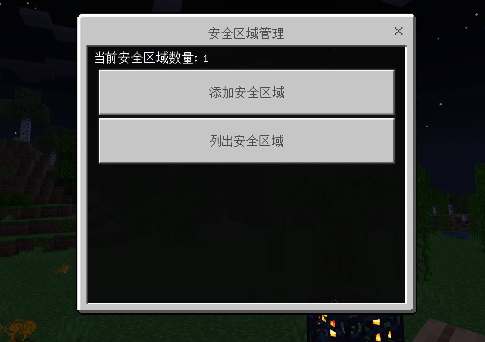

# SafeZone

创建一个安全区域，阻止区域内生成生物。



## 使用方法

```shell
lip install github.com/LiteLDev/LegacyScriptEngine # 本插件依赖quickjs
lip install --upgrade github.com/haojie06/LeviSafeZone
# 跟随UI操作即可，默认创建的安全区域不考虑z轴，只考虑x和y轴，在提交时也可以选择是否考虑z轴，如果考虑z轴，那么安全区域将是一个立方体。
/safezone 
```

当前创建出来的区域会阻止一切生物的自然生成，包括非敌对生物，之后考虑增加白名单。
